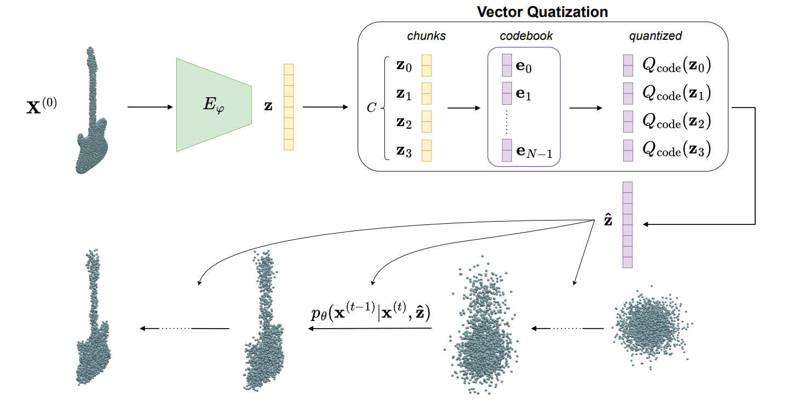
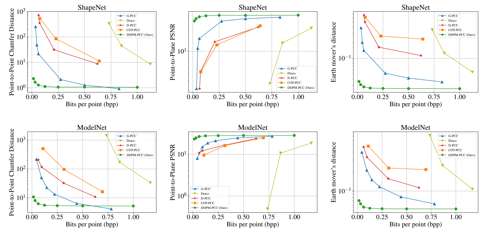
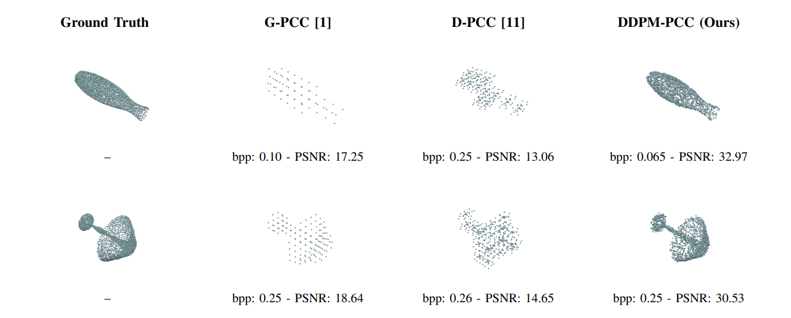

# Denoising Diffusion Probabilistic Model for Point Cloud Compression at Low Bit-Rates

Pytorch implementation of the paper "**Denoising Diffusion Probabilistic Model for Point Cloud Compression at Low Bit-Rates**", published at ICME 2025. This repository is based on [diffusion-point-cloud](https://github.com/luost26/diffusion-point-cloud).

[ArXiv version](https://arxiv.org/pdf/2505.13316?)


## Abstract
Efficient compression of low-bit-rate point clouds is
critical for bandwidth-constrained applications. However, existing
techniques mainly focus on high-fidelity reconstruction, requiring
many bits for compression. This paper proposes a “Denoising
Diffusion Probabilistic Model” (DDPM) architecture for point
cloud compression (DDPM-PCC) at low bit-rates. A PointNet
encoder produces the condition vector for the generation, which
is then quantized via a learnable vector quantizer. This configuration allows to achieve a low bitrates while preserving
quality. Experiments on ShapeNet and ModelNet40 show improved rate-distortion at low rates compared to standardized
and state-of-the-art approaches

<div align="center">

</div>


## Usage

### Environment
- conda env create -f env.yml
- conda activate point


### Eval
Download our pretrained model in the DDPM-PCC directory from [here](https://drive.google.com/file/d/1c1J2G4x5Zr_nIeQT4Qh2ga1Jtz1H9nj2/view?usp=sharing).
- Extract results_ddpm.zip
```
DDPM-PCC
│   README.md
│  
└───results
│   └───shapenet
│       │   ...
│   └───modelnet
│       │   ...
│   
└───src
    │   train.py
    │   ...
```

- Run:
```
sh run_all_eval.sh
```


### Train
Download Shapenet and ModelNet datasets in DDPM-PCC directory from [here](https://drive.google.com/file/d/1eDYUmGA5dXTlLkuf7S25vQ4w17lS-5SS/view?usp=sharing).
- Extract datasets.zip
```
DDPM-PCC
│   README.md
│  
└───datasets
│   └───modelnet40_ply_hdf5_2048/
│       │   ...
│   └───shapenet.hdf5
│   
└───src
    │   train.py
    │   ...
```

- Run:
**ShapeNet**
```
cd src

python train.py \
--dataset-path ../datasets/data/shapenet.hdf5 \
--dataset shapenet \
--latent-dim 256 \
--num-steps 200 \
--rotate 0 \
--save-dir ../results/shapenet/vq_diffusion/ae_all_pointnet_bs128 \
--encoder pointnet  \
--train-batch-size 128 \
--val-batch-size 1 \
--num-codecs 128 \
--dim-codecs 32 \
--vq-alpha 2.5
```


## Results

- Quantitavie Results
<div align="center">

</div>

- Qualitative Results
<div align="center">

</div>

